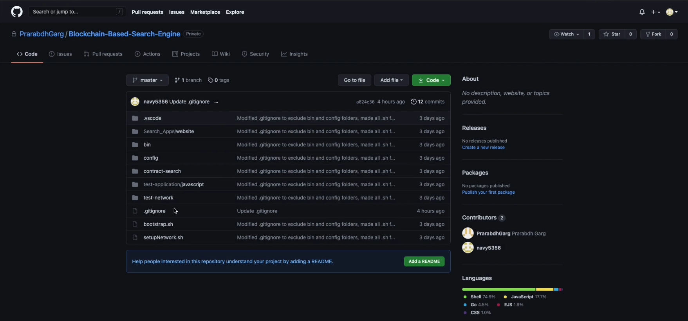
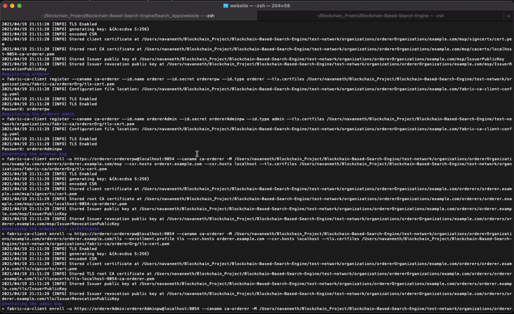
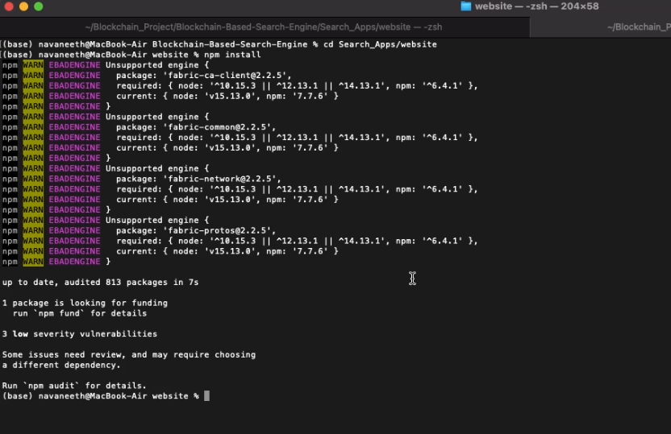
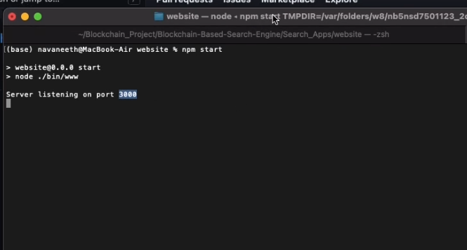
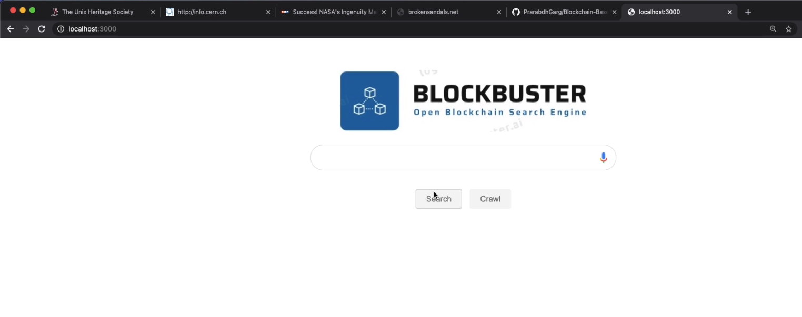
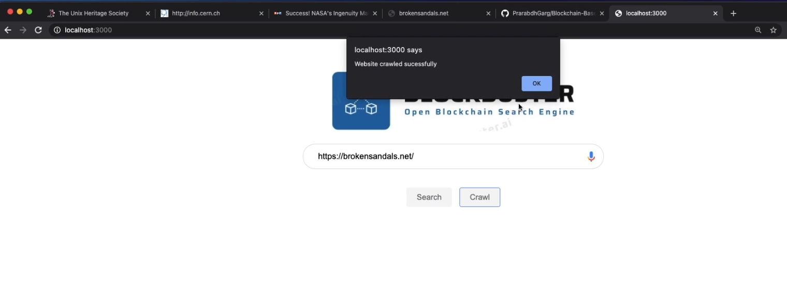
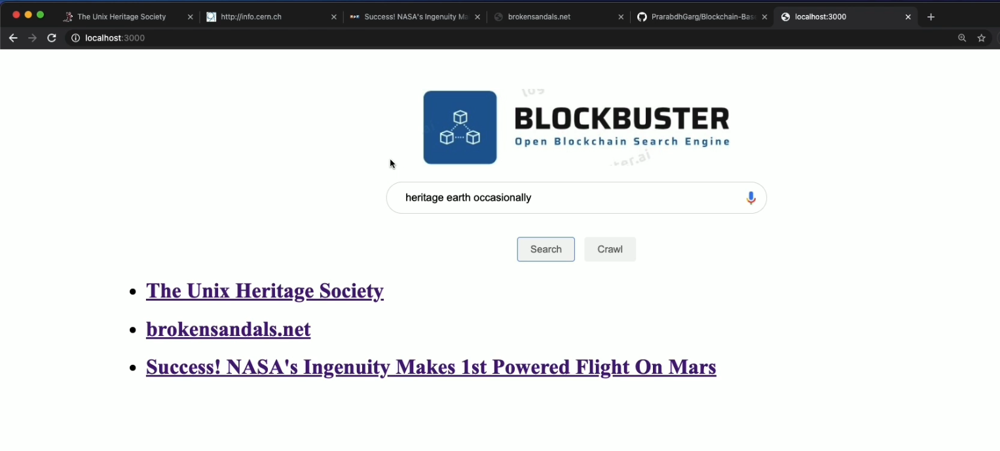

# Setup Instructions and Screenshots

## Prerequisites :
1. [Git](https://git-scm.com/downloads)
1. [cUrl](https://curl.se/download.html)
1. [Node](https://nodejs.org/en/) version v15.13.0 along with [npm](https://www.npmjs.com/package/npm) v7.7.6
1. MacOSX, \*nix, or Windows 10: [Docker](https://www.docker.com/get-started) Docker version 17.06.2-ce or greater is required. 
	You can check the version of docker with the following command:
	```
	$ docker --version
	```
	Make sure that the docker daemon is running
	```
	$ sudo systemctl start docker
	```
	Optional: To enable docker daemon on startup
	```
	$ sudo systemctl enable docker

	$ sudo usermod -a -G docker <username>
	```
	Installing Docker for Mac or Windows, or Docker Toolbox will also install Docker Compose. If you already had Docker installed, you should check that you 	have Docker Compose version 1.14.0 or greater installed. If not, we recommend that you install a more recent version of Docker.

1. (Only for Windows users)

	Run the following commands to configure git settings

	```
	   $ git config --global core.autocrlf false

	   $ git config --global core.longpaths true
	```

1. To get the go sdk for chaincode, run the command
	```
	   $ go get github.com/hyperledger/fabric-sdk-go
	```


## Setup Instructions :

1. Clone the repository from [Github](https://github.com/PrarabdhGarg/Blockchain-Based-Search-Engine).



### Setting up the Blockchain :

1. Run Docker Desktop by opening the application

1. Navigate to the base directory containing the cloned repository in a terminal

```
   $ cd <path to repo>/Blockchain-Based-Search-Engine`
```

1. Run the bash script to setup the Fabric Network

```
   $ ./setupNetwork.sh
```




### Running the Client Application :

1. Change to the website directory in the project folder
```
   $ cd ./Search\_Apps/website
```
1. Install Node.js dependencies
```
   $ npm install
```



1. Start the backend server for the GUI

```
$ npm start
```




1. Open localhost:3000 on a web browser to access the GUI




## Using the GUI:

1. **Crawling :** Enter the **full URL*** (eg: <http://www.tuhs.org>) of the website to be crawled. A pop-up will appear notifying when the crawling is complete. (Note : Depending on the number of words in the website, it may take quite a long time to finish crawling. You can check the terminal to view the progress of crawling).** 




1. **Searching :** Enter the search term and click on the Search button. Results will be displayed when lookup is complete.



